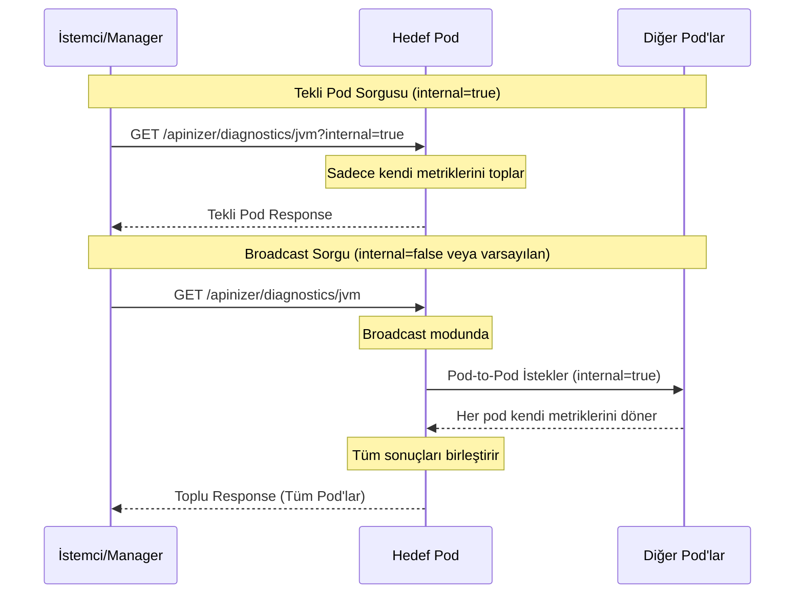
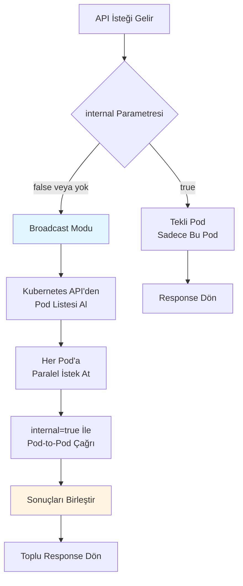

## Genel Bakış

Diagnostic endpoint'ler, Worker ve Cache modüllerinin çalışma durumu hakkında detaylı bilgi toplama imkanı sunar. Bu endpoint'ler ile JVM metrikleri, thread bilgileri, connection durumları, environment değişkenleri ve daha fazlasına erişim sağlayabilirsiniz.

### Kullanım Alanları

<CardGroup cols={2}>
<Card title="Performans Analizi" icon="chart-line">
JVM memory kullanımı, thread sayıları ve sistem kaynaklarını anlık olarak izleyebilirsiniz.
</Card>

<Card title="Sorun Tespiti" icon="bug">
Thread dump ve heap dump alarak memory leak ve deadlock sorunlarını tespit edebilirsiniz.
</Card>

<Card title="Kapasite Planlaması" icon="gauge">
Sistem kaynak kullanımını izleyerek ölçeklendirme kararları alabilirsiniz.
</Card>

<Card title="Merkezi İzleme" icon="eye">
Tüm pod'ları toplu olarak sorgulayarak cluster genelinde durum analizi yapabilirsiniz.
</Card>
</CardGroup>

### Erişim Yöntemleri

Diagnostic endpoint'lere iki farklı şekilde erişim sağlayabilirsiniz:

<Tabs>
<Tab title="Server Management Ekranı">

API Manager'daki **System → Server Management** ekranından görsel arayüz üzerinden tüm pod'ların diagnostic bilgilerine erişebilirsiniz. Bu yöntem, manual kontrol ve hızlı analiz için uygundur.

</Tab>
<Tab title="API Erişimi">

Doğrudan HTTP istekleri ile endpoint'lere erişim sağlayabilirsiniz. Bu yöntem, otomasyon, monitoring sistemleri ve script tabanlı kontroller için idealdir.

</Tab>
</Tabs>

## İş Akışı

Diagnostic endpoint'lerin çalışma mantığı aşağıdaki diyagramda gösterilmektedir:



### Broadcast Mekanizması

`internal=false` (veya parametre verilmediğinde), istenen pod tüm cluster içindeki diğer pod'lara istekleri iletir ve sonuçları toplar:



## Authorization

Tüm diagnostic endpoint'ler authorization gerektirir. İsteklerde **Environment ID** kullanılır:

<Steps>
<Step title="Authorization Header Ekle">
İstekte `Authorization` header'ında aktif environment ID'yi göndermelisiniz.

```bash
Authorization: <ENVIRONMENT_ID>
```
</Step>

<Step title="Doğrulama">
Worker ve Cache pod'ları gelen token'ı kendi environment ID'leri ile karşılaştırır.
</Step>

<Step title="Erişim">
Token eşleşirse istek işlenir, aksi halde `401 Unauthorized` döner.
</Step>
</Steps>

<Warning>
Environment ID'yi API Manager'dan **Environment** ayarlarından veya sistem yöneticisinden edinebilirsiniz. Yanlış veya eksik authorization bilgisi ile yapılan istekler reddedilir.
</Warning>

## Worker Diagnostic Endpoint'leri

Worker modülü için kullanılabilir endpoint'ler:

### JVM Metrikleri

JVM memory kullanımı, heap/non-heap bilgileri, garbage collection istatistikleri.

<Tabs>
<Tab title="Kubernetes İçinden">

```bash
# Tekli pod
kubectl exec -it <any_pod_name> -n <namespace> -- curl -X GET \
  -H "Authorization: <ENVIRONMENT_ID>" \
  "http://worker-http-service.prod.svc.cluster.local:8091/apinizer/diagnostics/jvm?internal=true"

# Tüm pod'lar (broadcast)
kubectl exec -it <any_pod_name> -n <namespace> -- curl -X GET \
  -H "Authorization: <ENVIRONMENT_ID>" \
  "http://worker-http-service.prod.svc.cluster.local:8091/apinizer/diagnostics/jvm"
```

</Tab>
<Tab title="Kubernetes Dışından">

```bash
# Tekli pod
curl -X GET \
  -H "Authorization: <ENVIRONMENT_ID>" \
  "http://<WORKER_ACCESS_URL>/apinizer/diagnostics/jvm?internal=true"

# Tüm pod'lar (broadcast)
curl -X GET \
  -H "Authorization: <ENVIRONMENT_ID>" \
  "http://<WORKER_ACCESS_URL>/apinizer/diagnostics/jvm"
```

</Tab>
</Tabs>

### Thread Bilgileri

Aktif thread sayısı, thread durumları, thread pool kullanımı.

<Tabs>
<Tab title="Kubernetes İçinden">

```bash
kubectl exec -it <any_pod_name> -n <namespace> -- curl -X GET \
  -H "Authorization: <ENVIRONMENT_ID>" \
  "http://worker-http-service.prod.svc.cluster.local:8091/apinizer/diagnostics/threads?internal=true"
```

</Tab>
<Tab title="Kubernetes Dışından">

```bash
curl -X GET \
  -H "Authorization: <ENVIRONMENT_ID>" \
  "http://<WORKER_ACCESS_URL>/apinizer/diagnostics/threads"
```

</Tab>
</Tabs>

### Thread Dump

Tüm thread'lerin detaylı stack trace bilgileri. Deadlock tespiti için kullanılır.

<Tabs>
<Tab title="Kubernetes İçinden">

```bash
kubectl exec -it <any_pod_name> -n <namespace> -- curl -X GET \
  -H "Authorization: <ENVIRONMENT_ID>" \
  "http://worker-http-service.prod.svc.cluster.local:8091/apinizer/diagnostics/threaddump?internal=true"
```

</Tab>
<Tab title="Kubernetes Dışından">

```bash
curl -X GET \
  -H "Authorization: <ENVIRONMENT_ID>" \
  "http://<WORKER_ACCESS_URL>/apinizer/diagnostics/threaddump"
```

</Tab>
</Tabs>

### Heap Dump

JVM heap memory'nin binary dump'ı. Memory analizi için kullanılır.

<Info>
Heap dump endpoint'i **broadcast desteklemez** ve çıktı olarak binary dosya (.hprof) döner. Bu nedenle `internal` parametresi kullanılmaz ve sonuç bir dosyaya kaydedilmelidir.
</Info>

<Tabs>
<Tab title="Kubernetes İçinden">

```bash
kubectl exec -it <any_pod_name> -n <namespace> -- curl -X GET \
  -H "Authorization: <ENVIRONMENT_ID>" \
  "http://worker-http-service.prod.svc.cluster.local:8091/apinizer/diagnostics/heapdump" \
  --output heapdump-$(date +%Y%m%d-%H%M%S).hprof
```

</Tab>
<Tab title="Kubernetes Dışından">

```bash
curl -X GET \
  -H "Authorization: <ENVIRONMENT_ID>" \
  "http://<WORKER_ACCESS_URL>/apinizer/diagnostics/heapdump" \
  --output heapdump-$(date +%Y%m%d-%H%M%S).hprof
```

</Tab>
</Tabs>

### Connection Bilgileri

Aktif HTTP connection'lar, connection pool durumları, backend bağlantıları.

<Tabs>
<Tab title="Kubernetes İçinden">

```bash
kubectl exec -it <any_pod_name> -n <namespace> -- curl -X GET \
  -H "Authorization: <ENVIRONMENT_ID>" \
  "http://worker-http-service.prod.svc.cluster.local:8091/apinizer/diagnostics/connections?internal=true"
```

</Tab>
<Tab title="Kubernetes Dışından">

```bash
curl -X GET \
  -H "Authorization: <ENVIRONMENT_ID>" \
  "http://<WORKER_ACCESS_URL>/apinizer/diagnostics/connections"
```

</Tab>
</Tabs>

### Environment Değişkenleri

Sistem ve JVM environment değişkenleri, system properties.

<Tabs>
<Tab title="Kubernetes İçinden">

```bash
kubectl exec -it <any_pod_name> -n <namespace> -- curl -X GET \
  -H "Authorization: <ENVIRONMENT_ID>" \
  "http://worker-http-service.prod.svc.cluster.local:8091/apinizer/diagnostics/env?internal=true"
```

</Tab>
<Tab title="Kubernetes Dışından">

```bash
curl -X GET \
  -H "Authorization: <ENVIRONMENT_ID>" \
  "http://<WORKER_ACCESS_URL>/apinizer/diagnostics/env"
```

</Tab>
</Tabs>

### Health Durumu

Pod'un sağlık durumu, uptime, temel sistem bilgileri.

<Tabs>
<Tab title="Kubernetes İçinden">

```bash
kubectl exec -it <any_pod_name> -n <namespace> -- curl -X GET \
  -H "Authorization: <ENVIRONMENT_ID>" \
  "http://worker-http-service.prod.svc.cluster.local:8091/apinizer/diagnostics/health?internal=true"
```

</Tab>
<Tab title="Kubernetes Dışından">

```bash
curl -X GET \
  -H "Authorization: <ENVIRONMENT_ID>" \
  "http://<WORKER_ACCESS_URL>/apinizer/diagnostics/health"
```

</Tab>
</Tabs>

### Tüm Metrikler

Heap dump hariç tüm metrikleri tek bir çağrıda toplar.

<Tabs>
<Tab title="Kubernetes İçinden">

```bash
kubectl exec -it <any_pod_name> -n <namespace> -- curl -X GET \
  -H "Authorization: <ENVIRONMENT_ID>" \
  "http://worker-http-service.prod.svc.cluster.local:8091/apinizer/diagnostics/all?internal=true"
```

</Tab>
<Tab title="Kubernetes Dışından">

```bash
curl -X GET \
  -H "Authorization: <ENVIRONMENT_ID>" \
  "http://<WORKER_ACCESS_URL>/apinizer/diagnostics/all"
```

</Tab>
</Tabs>

## Cache Diagnostic Endpoint'leri

Cache modülü için kullanılabilir endpoint'ler:

### JVM Metrikleri

<Tabs>
<Tab title="Kubernetes İçinden">

```bash
# Tekli pod
kubectl exec -it <any_pod_name> -n <namespace> -- curl -X GET \
  -H "Authorization: <ENVIRONMENT_ID>" \
  "http://cache-http-service.prod.svc.cluster.local:8090/apinizer/diagnostics/jvm?internal=true"

# Tüm pod'lar (broadcast)
kubectl exec -it <any_pod_name> -n <namespace> -- curl -X GET \
  -H "Authorization: <ENVIRONMENT_ID>" \
  "http://cache-http-service.prod.svc.cluster.local:8090/apinizer/diagnostics/jvm"
```

</Tab>
<Tab title="Kubernetes Dışından">

```bash
curl -X GET \
  -H "Authorization: <ENVIRONMENT_ID>" \
  "http://<CACHE_ACCESS_URL>/apinizer/diagnostics/jvm"
```

</Tab>
</Tabs>

### Thread Bilgileri

<Tabs>
<Tab title="Kubernetes İçinden">

```bash
kubectl exec -it <any_pod_name> -n <namespace> -- curl -X GET \
  -H "Authorization: <ENVIRONMENT_ID>" \
  "http://cache-http-service.prod.svc.cluster.local:8090/apinizer/diagnostics/threads?internal=true"
```

</Tab>
<Tab title="Kubernetes Dışından">

```bash
curl -X GET \
  -H "Authorization: <ENVIRONMENT_ID>" \
  "http://<CACHE_ACCESS_URL>/apinizer/diagnostics/threads"
```

</Tab>
</Tabs>

### Thread Dump

<Tabs>
<Tab title="Kubernetes İçinden">

```bash
kubectl exec -it <any_pod_name> -n <namespace> -- curl -X GET \
  -H "Authorization: <ENVIRONMENT_ID>" \
  "http://cache-http-service.prod.svc.cluster.local:8090/apinizer/diagnostics/threaddump?internal=true"
```

</Tab>
<Tab title="Kubernetes Dışından">

```bash
curl -X GET \
  -H "Authorization: <ENVIRONMENT_ID>" \
  "http://<CACHE_ACCESS_URL>/apinizer/diagnostics/threaddump"
```

</Tab>
</Tabs>

### Heap Dump

<Tabs>
<Tab title="Kubernetes İçinden">

```bash
kubectl exec -it <any_pod_name> -n <namespace> -- curl -X GET \
  -H "Authorization: <ENVIRONMENT_ID>" \
  "http://cache-http-service.prod.svc.cluster.local:8090/apinizer/diagnostics/heapdump" \
  --output cache-heapdump-$(date +%Y%m%d-%H%M%S).hprof
```

</Tab>
<Tab title="Kubernetes Dışından">

```bash
curl -X GET \
  -H "Authorization: <ENVIRONMENT_ID>" \
  "http://<CACHE_ACCESS_URL>/apinizer/diagnostics/heapdump" \
  --output cache-heapdump-$(date +%Y%m%d-%H%M%S).hprof
```

</Tab>
</Tabs>

### Environment Değişkenleri

<Tabs>
<Tab title="Kubernetes İçinden">

```bash
kubectl exec -it <any_pod_name> -n <namespace> -- curl -X GET \
  -H "Authorization: <ENVIRONMENT_ID>" \
  "http://cache-http-service.prod.svc.cluster.local:8090/apinizer/diagnostics/env?internal=true"
```

</Tab>
<Tab title="Kubernetes Dışından">

```bash
curl -X GET \
  -H "Authorization: <ENVIRONMENT_ID>" \
  "http://<CACHE_ACCESS_URL>/apinizer/diagnostics/env"
```

</Tab>
</Tabs>

### Health Durumu

<Tabs>
<Tab title="Kubernetes İçinden">

```bash
kubectl exec -it <any_pod_name> -n <namespace> -- curl -X GET \
  -H "Authorization: <ENVIRONMENT_ID>" \
  "http://cache-http-service.prod.svc.cluster.local:8090/apinizer/diagnostics/health?internal=true"
```

</Tab>
<Tab title="Kubernetes Dışından">

```bash
curl -X GET \
  -H "Authorization: <ENVIRONMENT_ID>" \
  "http://<CACHE_ACCESS_URL>/apinizer/diagnostics/health"
```

</Tab>
</Tabs>

### Hazelcast Metrikleri

Hazelcast cluster bilgileri, cache istatistikleri, distributed map metrikleri.

<Info>
Bu endpoint **sadece Cache modülünde** mevcuttur ve Hazelcast cluster'ın detaylı durumunu gösterir.
</Info>

<Tabs>
<Tab title="Kubernetes İçinden">

```bash
kubectl exec -it <any_pod_name> -n <namespace> -- curl -X GET \
  -H "Authorization: <ENVIRONMENT_ID>" \
  "http://cache-http-service.prod.svc.cluster.local:8090/apinizer/diagnostics/hazelcast?internal=true"
```

</Tab>
<Tab title="Kubernetes Dışından">

```bash
curl -X GET \
  -H "Authorization: <ENVIRONMENT_ID>" \
  "http://<CACHE_ACCESS_URL>/apinizer/diagnostics/hazelcast"
```

</Tab>
</Tabs>

### Tüm Metrikler

<Tabs>
<Tab title="Kubernetes İçinden">

```bash
kubectl exec -it <any_pod_name> -n <namespace> -- curl -X GET \
  -H "Authorization: <ENVIRONMENT_ID>" \
  "http://cache-http-service.prod.svc.cluster.local:8090/apinizer/diagnostics/all?internal=true"
```

</Tab>
<Tab title="Kubernetes Dışından">

```bash
curl -X GET \
  -H "Authorization: <ENVIRONMENT_ID>" \
  "http://<CACHE_ACCESS_URL>/apinizer/diagnostics/all"
```

</Tab>
</Tabs>

## Endpoint Karşılaştırma Tablosu

| Endpoint | Worker | Cache | Broadcast | Açıklama |
|----------|--------|-------|-----------|----------|
| `/jvm` | ✅ | ✅ | ✅ | JVM memory ve GC metrikleri |
| `/threads` | ✅ | ✅ | ✅ | Thread bilgileri ve durumları |
| `/threaddump` | ✅ | ✅ | ✅ | Detaylı thread stack trace |
| `/heapdump` | ✅ | ✅ | ❌ | Binary heap dump dosyası |
| `/connections` | ✅ | ❌ | ✅ | HTTP connection pool bilgileri |
| `/env` | ✅ | ✅ | ✅ | Environment değişkenleri |
| `/health` | ✅ | ✅ | ✅ | Sağlık durumu ve uptime |
| `/hazelcast` | ❌ | ✅ | ✅ | Hazelcast cluster metrikleri |
| `/all` | ✅ | ✅ | ✅ | Tüm metrikler (heapdump hariç) |

## Kullanım Senaryoları

<AccordionGroup>
<Accordion title="Memory Leak Tespiti">

1. `/jvm` endpoint'i ile memory kullanımını düzenli olarak izleyin
2. Heap memory'nin sürekli artış gösterdiğini tespit edin
3. `/heapdump` ile heap dump alın
4. Eclipse MAT veya VisualVM ile analiz edin

```bash
# Memory kullanımını izleme
curl -X GET -H "Authorization: <ENV_ID>" \
  "http://<WORKER_URL>/apinizer/diagnostics/jvm" | jq '.pods[].jvm.memory'

# Heap dump alma
curl -X GET -H "Authorization: <ENV_ID>" \
  "http://<WORKER_URL>/apinizer/diagnostics/heapdump" \
  --output analysis.hprof
```

</Accordion>

<Accordion title="Deadlock Analizi">

Thread dump alarak deadlock durumlarını tespit edebilirsiniz:

```bash
# Thread dump alma
curl -X GET -H "Authorization: <ENV_ID>" \
  "http://<WORKER_URL>/apinizer/diagnostics/threaddump" \
  | jq '.pods[].threadDump' > threaddump.txt

# Dosyada "deadlock" kelimesini arayın
grep -i "deadlock" threaddump.txt
```

</Accordion>

<Accordion title="Cluster Geneli Performans Analizi">

Tüm pod'ların durumunu tek çağrıda kontrol edebilirsiniz:

```bash
# Tüm pod'ların tüm metriklerini al
curl -X GET -H "Authorization: <ENV_ID>" \
  "http://<WORKER_URL>/apinizer/diagnostics/all" \
  | jq '.' > cluster-diagnostics.json

# Her pod'un memory kullanımını listele
cat cluster-diagnostics.json | jq '.pods[] | {pod: .podName, heapUsed: .jvm.memory.heap.used, heapMax: .jvm.memory.heap.max}'
```

</Accordion>

<Accordion title="Otomatik Monitoring Entegrasyonu">

Prometheus, Grafana veya custom monitoring sistemlerine entegre edebilirsiniz:

```bash
#!/bin/bash
# monitoring-script.sh
while true; do
  RESPONSE=$(curl -s -X GET -H "Authorization: $ENV_ID" \
    "http://$WORKER_URL/apinizer/diagnostics/jvm")
  
  echo "$RESPONSE" | jq -r '.pods[] | "\(.podName) - Heap: \(.jvm.memory.heap.used)/\(.jvm.memory.heap.max)"'
  
  sleep 60
done
```

</Accordion>

<Accordion title="Connection Pool İzleme">

Worker pod'larındaki connection pool durumlarını kontrol edebilirsiniz:

```bash
# Connection pool metrikleri
curl -X GET -H "Authorization: <ENV_ID>" \
  "http://<WORKER_URL>/apinizer/diagnostics/connections" \
  | jq '.pods[] | {pod: .podName, activeConnections: .connections.active, idleConnections: .connections.idle}'
```

</Accordion>
</AccordionGroup>

## Best Practices

<CardGroup cols={2}>
<Card title="Düzenli İzleme" icon="clock">
`/health` ve `/jvm` endpoint'lerini periyodik olarak kontrol ederek proaktif sorun tespiti yapın.
</Card>

<Card title="Broadcast Kullanımı" icon="tower-broadcast">
Production ortamında tüm pod'ları kontrol etmek için broadcast mode kullanın (`internal` parametresi olmadan).
</Card>

<Card title="Heap Dump Boyutu" icon="hard-drive">
Heap dump'lar büyük dosyalar oluşturabilir. Yeterli disk alanı olduğundan emin olun.
</Card>

<Card title="Authorization Güvenliği" icon="shield">
Environment ID'yi güvenli şekilde saklayın ve loglarda göstermeyin.
</Card>
</CardGroup>

<Warning>
**Performans Notu**: Heap dump ve thread dump işlemleri pod üzerinde yük oluşturabilir. Production ortamında bu işlemleri düşük yoğunluk saatlerinde gerçekleştirmeniz önerilir.
</Warning>

## İlgili Kaynaklar

Daha fazla bilgi için aşağıdaki sayfalara göz atabilirsiniz:

- [Healthcheck ve Sürüm Adresleri](/tr/operations/healthcheck-versiyon-adresleri)
- [Prometheus ve Grafana Entegrasyonu](/tr/operations/yonetici-kilavuzlari/prometheus-grafana-entegrasyonu)
- [Gateway Metrics Entegrasyonu](/tr/operations/yonetici-kilavuzlari/gateway-metrics-entegrasyonu/gateway-metrics-genel-bakis)
- [Cache Metrics Entegrasyonu](/tr/operations/yonetici-kilavuzlari/cache-metrics-entegrasyonu/cache-metrics-genel-bakis)

