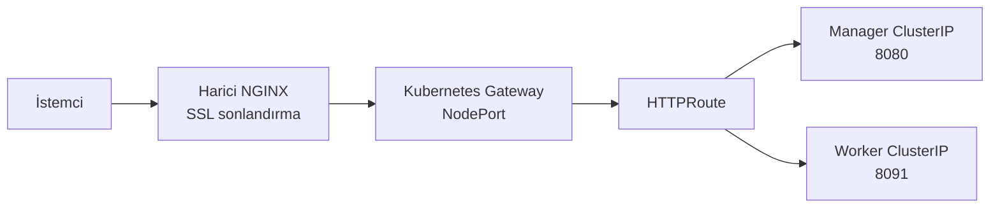

Kubernetes'te dış trafiği yönetmek için uzun süre **Service (NodePort / LoadBalancer)** ve ardından **Ingress** kullanıldı. Gateway API, Ingress'in yerini alan değil; Ingress'in eksiklerini gideren resmi yeni nesil trafik katmanıdır.

Bu dokümanda Gateway API'nin neden ortaya çıktığı, Ingress'ten farkı ve **zaten kurulu bir Apinizer ortamının** önüne NGINX Gateway Fabric ile nasıl konulacağı anlatılır.

:::info

Apinizer Manager ve Worker pod'larını silmeniz, image değiştirmeniz veya namespace taşımanız gerekmez. Değişen yalnızca cluster'a giren HTTP trafiğinin yönlendirme katmanıdır.

:::

:::warning İki farklı "Gateway"

**Apinizer Gateway (Worker)**, API'leri yöneten Apinizer bileşenidir (genelde port `8091`).

**Kubernetes Gateway API**, cluster'a giren HTTP/TCP/UDP trafiğini standart CRD'lerle yönlendiren Kubernetes katmanıdır.

Bu sayfa ikincisini kurar ve mevcut Apinizer servislerine bağlar.

:::

## Kubernetes'te Trafik Yönetiminin Evrimi

Kubernetes ilk çıktığında dış dünyadan gelen trafik **Service** ile yönetiliyordu (`NodePort` veya `LoadBalancer`). HTTP tabanlı host ve path yönlendirmesi ihtiyacı artınca **Ingress** ortaya çıktı.

Ingress basit senaryolar için yeterlidir; ancak çok ekipli, çok namespace'li ve yetki ayrımı gerektiren ortamlarda yetersiz kalır. Gelişmiş özellikler (trafik bölme, header değiştirme, redirect, rewrite) standart API'de yoktur; her Ingress Controller kendi **annotation**'larıyla çözer. Kubernetes bu annotation'ları doğrulayamaz; davranış vendor'a bağlanır.

Bu noktada Kubernetes SIG-Network, **Gateway API**'yi resmi proje olarak geliştirdi. Amaç Layer 4 (TCP/UDP) ve Layer 7 (HTTP/HTTPS/gRPC) yönlendirmesini **standart, rol bazlı ve genişletilebilir** hale getirmektir.

## Ingress'in Kısa Hatırlatması

Ingress, Kubernetes'e HTTP/HTTPS trafiğini tanıtmak için kullanılan bir API nesnesidir. Temel yetenekleri:

- Host bazlı yönlendirme
- Path bazlı yönlendirme

Kurumsal ve çok kiracılı (multi-tenant) yapılarda sınırlamaları vardır:

- Namespace izolasyonu ve RBAC ile yetki ayrımı zayıftır
- Tek bir Ingress kaynağı farklı ekiplerin trafiğini kontrol edebilir
- Trafik bölme, header manipülasyonu, redirect/rewrite, rate limiting gibi özellikler standart değildir
- Validation runtime'da controller'a bırakılır

## Gateway API Nedir?

Gateway API, Kubernetes'e CRD olarak eklenen resmi bir API ailesidir. Ingress + L4 load balancer + servis mesh yönlendirme yaklaşımını **tek bir API çatısı** altında birleştirir.

Getirdikleri:

- HTTP, HTTPS, TCP, UDP ve gRPC desteği
- Rol bazlı ayrım: `GatewayClass` (altyapı), `Gateway` (cluster operatörü), `HTTPRoute` (uygulama ekibi)
- Namespace bazlı izolasyon ve multi-tenant kullanıma uygunluk
- Vendor bağımsız, Kubernetes tarafından validate edilen kaynaklar
- Annotation yerine native filter'lar (redirect, rewrite, header, traffic split, request mirror)

Gateway API yalnızca bir **API tanımıdır**. Gerçek trafiği taşımak için bir **Gateway Controller** gerekir. Bu rehberde controller olarak **NGINX Gateway Fabric** kullanılır; anlatılan kaynaklar (`Gateway`, `HTTPRoute`) controller bağımsızdır.

## Ingress vs Gateway API

| Özellik | Ingress | Gateway API |
| --- | --- | --- |
| Protokol | HTTP/HTTPS | HTTP/HTTPS/TCP/UDP/gRPC |
| Multi-tenancy | Yok | Var |
| RBAC / rol ayrımı | Sınırlı | `GatewayClass`, `Gateway`, `Route` |
| Traffic splitting | Yok (annotation) | Native |
| Header manipulation | Annotation | Native |
| Validation | Runtime, controller'a bağlı | API seviyesinde |
| Vendor lock-in | Yüksek (annotation) | Düşük (standart API) |

Gateway API, Kubernetes'te **CRD** olarak kurulur; bu nedenle Kubernetes sürümünden bağımsız güncellenebilir. Bu rehber **NGINX Gateway Fabric v2.7.2** ile birlikte gelen Gateway API CRD'lerini kullanır.

## Apinizer Ortamında Trafik Akışı

Apinizer zaten cluster'da çalışıyorsa Worker'ı yeniden kurmazsınız. Cluster'ın önüne Gateway API katmanını koyarsınız:



LoadBalancer VIP alamayan on-prem ortamlarda (MetalLB yok) tipik senaryo şudur:

```
İnternet
  → mevcut harici NGINX (SSL)
    → Kubernetes Gateway (NodePort)
      → HTTPRoute
        → Manager Service  (ör. qa.apinizer.com)
        → Worker Service   (ör. apiqa.apinizer.com)
```

Cloud veya MetalLB varsa Gateway servisi doğrudan `LoadBalancer` VIP alır; harici NGINX katmanı gerekmez.

## Kurulumda Gerekli / Gerekmeyen

İlk kurulumda gerekli olanlar:

- Gateway API CRD'leri
- NGINX Gateway Fabric
- 1 adet `Gateway`
- Manager için `HTTPRoute`
- Her Worker ortamı için `HTTPRoute`
- VIP yoksa öndeki NGINX'i yeni NodePort'a çevirmek

İlk kurulumda **gerekmeyenler**: traffic split, request mirror, path rewrite, TCP/UDP, gRPC. Bunlar sistem ayağa kalktıktan sonra `HTTPRoute` filter'larıyla eklenir.

Yeni Manager veya Worker Service açmayın; mevcut servis adlarını kullanın. Eski Ingress veya NodePort yollarını Gateway doğrulanmadan silmeyin.

## 1. Adım – Mevcut Ortamı Yazın

Cluster'a bağlanıp şu komutları çalıştırın:

```bash
kubectl get ns
kubectl get deploy,svc,ing -A | grep -E 'apimanager|worker|manager|ingress|nginx'
helm list -A
kubectl get gatewayclass,gateway,httproute -A
```

Not alın:

- Manager hangi namespace'te? (sık görülen: `apinizer`)
- Worker hangi namespace'te? (örnek: `prod`, `test`)
- Manager Service adı ve portu (hedef genelde `8080`)
- Worker Service adı ve portu (hedef genelde `8091`)
- Dışarıdan hangi domain'ler geliyor?
- Önde zaten Ingress veya harici NGINX var mı?

Örnek bir Apinizer cluster çıktısı şöyle durur:

| Bileşen | Namespace | Service | Tip | Port |
| --- | --- | --- | --- | --- |
| Manager | `apinizer` | `apimanager` | NodePort (`32080`) | `8080` |
| Worker (prod) | `prod` | `worker-management-api-http-service` | ClusterIP | `8091` |
| Worker (test) | `test` | `worker-management-api-http-service` | ClusterIP | `8091` |

Aynı namespace'te `worker-http-service` adlı **NodePort** servisler de olabilir (`30080`, `30090`). HTTPRoute backend'i olarak bunları kullanmayın; hedef **ClusterIP** olan `worker-management-api-http-service` olmalıdır.

Helm yoksa sorun değildir; bu rehber `kubectl` manifest'leriyle kurulur.

Aşağıdaki değerleri kendi ortamınıza göre doldurun:

```bash
MANAGER_NS=apinizer
MANAGER_SVC=apimanager
MANAGER_PORT=8080
MANAGER_HOST=qa.apinizer.com

WORKER_PROD_NS=prod
WORKER_TEST_NS=test
WORKER_SVC=worker-management-api-http-service
WORKER_PORT=8091
WORKER_PROD_HOST=apiqa.apinizer.com
WORKER_TEST_HOST=apitest.apinizer.com

GATEWAY_NS=default
GATEWAY_NAME=nginx-gateway
DOMAIN_WILDCARD="*.apinizer.com"
```

## 2. Adım – Gateway API CRD'lerini Kurun

Gateway API, Kubernetes'in yerleşik nesnesi değildir; cluster'a CRD olarak eklenir. Apinizer Manager ve Worker için HTTP yeterlidir; TCP/UDP şimdilik gerekmez.

NGINX Gateway Fabric sürümüyle uyumlu **standard** channel'ı kurun:

```bash
kubectl kustomize "https://github.com/nginx/nginx-gateway-fabric/config/crd/gateway-api/standard?ref=v2.7.2" | kubectl apply --server-side -f -
```

Kontrol:

```bash
kubectl get crd | grep gateway.networking.k8s.io
```

Görmeniz gerekenler: `gatewayclasses`, `gateways`, `httproutes`, `grpcroutes`, `referencegrants`.

:::warning

`standard-install.yaml` ve `experimental-install.yaml` dosyalarını peş peşe uygulamayın. CRD sürümü, kuracağınız NGINX Gateway Fabric sürümüyle aynı olmalıdır. TCP/UDP sonra gerekirse experimental channel'a geçersiniz.

:::

## 3. Adım – NGINX Gateway Fabric Kurun

Gateway API yalnızca tanımdır. Trafiği gerçekten taşıyan controller gerekir. Helm yoksa resmi NodePort manifest'i yeterlidir. cert-manager kurmanız gerekmez; manifest içindeki sertifika job'ı yeterlidir.

```bash
kubectl create namespace nginx-gateway
kubectl apply --server-side -f https://raw.githubusercontent.com/nginx/nginx-gateway-fabric/v2.7.2/deploy/crds.yaml
kubectl apply -f https://raw.githubusercontent.com/nginx/nginx-gateway-fabric/v2.7.2/deploy/nodeport/deploy.yaml
```

Cloud veya MetalLB ile VIP alabiliyorsanız `nodeport/deploy.yaml` yerine `default/deploy.yaml` kullanın (LoadBalancer).

Helm varsa alternatif:

```bash
helm install ngf oci://ghcr.io/nginx/charts/nginx-gateway-fabric \
  --create-namespace -n nginx-gateway \
  --set nginx.service.type=NodePort
```

Kontrol:

```bash
kubectl get pods -n nginx-gateway
kubectl get gatewayclass
```

Pod `Running` olmalı. `GatewayClass` adı genelde `nginx` olur; manifest veya Helm bunu kendisi yaratır.

:::warning

`GatewayClass` nesnesini elle `controllerName: nginx.org/gateway-controller` ile yaratmayın. NGINX Gateway Fabric'in beklediği değer:

```
gateway.nginx.org/nginx-gateway-controller
```

Hazır gelen `nginx` sınıfını kullanın.

:::

## 4. Adım – Gateway Tanımlayın

`Gateway`, cluster'a trafiğin nereden gireceğini tanımlar. Platform katmanıdır; bir kez tanımlanır.

Hostname'i kendi ana domain'inizle değiştirin. Manager ve Worker ayrı subdomain olacaksa wildcard yeterlidir.

```yaml
apiVersion: gateway.networking.k8s.io/v1
kind: Gateway
metadata:
  name: nginx-gateway
  namespace: default
spec:
  gatewayClassName: nginx
  listeners:
  - name: http
    protocol: HTTP
    port: 80
    hostname: "*.apinizer.com"
    allowedRoutes:
      namespaces:
        from: All
```

Alanlar:

- `gatewayClassName`: Bu Gateway'i hangi controller'ın yöneteceği (`nginx`)
- `listeners.protocol` / `port`: HTTP, port 80
- `hostname`: Bu listener'ın kabul edeceği host'lar
- `allowedRoutes.namespaces.from: All`: Tüm namespace'lerdeki `HTTPRoute` nesnelerinin bu Gateway'i kullanmasına izin verir

Uygulayın:

```bash
kubectl apply -f gateway.yaml
kubectl get gateway -n default
kubectl describe gateway nginx-gateway -n default
```

Beklenen durum:

- `Accepted=True`
- `Programmed=True`
- Aynı anda bir Service oluşur (`NodePort` veya `LoadBalancer`)

NGINX Gateway Fabric, Gateway tanımlandıktan sonra data-plane pod'larını ve servisini provision eder. NodePort numarasını alın:

```bash
kubectl get svc -A | grep -i nginx
```

Örnek: `80:32476/TCP` → harici NGINX'e yazacağınız port `32476`. Bu değer mevcut Apinizer NodePort'ları (`32080`, `30080`, `30090`) değildir.

## 5. Adım – HTTPRoute ile Apinizer Servislerine Bağlayın

`HTTPRoute`, Ingress'teki "host + path → backend" karşılığıdır. Route, **uygulamanın bulunduğu namespace'te** durur; Gateway `default` namespace'te kalsa da `parentRefs.namespace: default` ile bağlanır.

Mevcut ClusterIP / Service varsa yeni servis açmayın. Selector uydurmayın; endpoint boş kalırsa `502` alırsınız.

Selector'ı doğrulamak isterseniz:

```bash
kubectl get deploy,po -n apinizer --show-labels
kubectl get endpoints -n apinizer apimanager
kubectl get endpoints -n prod worker-management-api-http-service
kubectl get endpoints -n test worker-management-api-http-service
```

`ENDPOINTS` boşsa HTTPRoute'u henüz bağlamayın.

### Manager

```yaml
apiVersion: gateway.networking.k8s.io/v1
kind: HTTPRoute
metadata:
  name: apinizer-manager-route
  namespace: apinizer
spec:
  parentRefs:
  - name: nginx-gateway
    namespace: default
  hostnames:
  - qa.apinizer.com
  rules:
  - matches:
    - path:
        type: PathPrefix
        value: /
    backendRefs:
    - name: apimanager
      port: 8080
```

`qa.apinizer.com` gelen istekler Gateway üzerinden `apimanager` servisine (`8080`) gider.

### Worker (prod)

```yaml
apiVersion: gateway.networking.k8s.io/v1
kind: HTTPRoute
metadata:
  name: apinizer-worker-prod-route
  namespace: prod
spec:
  parentRefs:
  - name: nginx-gateway
    namespace: default
  hostnames:
  - apiqa.apinizer.com
  rules:
  - matches:
    - path:
        type: PathPrefix
        value: /
    backendRefs:
    - name: worker-management-api-http-service
      port: 8091
```

### Worker (test)

```yaml
apiVersion: gateway.networking.k8s.io/v1
kind: HTTPRoute
metadata:
  name: apinizer-worker-test-route
  namespace: test
spec:
  parentRefs:
  - name: nginx-gateway
    namespace: default
  hostnames:
  - apitest.apinizer.com
  rules:
  - matches:
    - path:
        type: PathPrefix
        value: /
    backendRefs:
    - name: worker-management-api-http-service
      port: 8091
```

Uygulayın ve durumu okuyun:

```bash
kubectl apply -f manager-httproute.yaml
kubectl apply -f worker-prod-httproute.yaml
kubectl apply -f worker-test-httproute.yaml
kubectl get httproute -A
kubectl describe httproute apinizer-manager-route -n apinizer
kubectl describe httproute apinizer-worker-prod-route -n prod
kubectl describe httproute apinizer-worker-test-route -n test
```

`parentRefs` **Accepted** olmalıdır. `Accepted=False` ise genelde:

- Gateway adı veya namespace yanlış
- HTTPRoute hostname'i Gateway listener hostname ile uyuşmuyor (`*.apinizer.com` dışındaki bir host)
- `allowedRoutes` o namespace'e izin vermiyor

## 6. Adım – Harici NGINX'i Gateway NodePort'a Çevirin

LoadBalancer VIP yoksa SSL cluster içinde değil, öndeki NGINX'te biter. Bu katman Gateway API'nin önünde geçici bir L7 proxy görevi görür.

1. Gateway NodePort değerini alın (`NODEPORT`)
2. Node IP veya VIP'i alın (`NODE_IP`)
3. Öndeki NGINX'te `proxy_pass` hedefini **eski Apinizer NodePort değil**, Gateway NodePort yapın

Worker örneği (`/etc/nginx/sites-enabled/apiqa.apinizer.com`):

```nginx
server {
    server_name apiqa.apinizer.com;
    listen 443 ssl;
    ssl_certificate     /etc/letsencrypt/live/apiqa.apinizer.com/fullchain.pem;
    ssl_certificate_key /etc/letsencrypt/live/apiqa.apinizer.com/privkey.pem;
    underscores_in_headers on;

    location / {
        proxy_set_header Host $host;
        proxy_set_header X-Real-IP $remote_addr;
        proxy_set_header X-Forwarded-For $proxy_add_x_forwarded_for;
        client_max_body_size 100M;

        proxy_http_version 1.1;
        proxy_set_header Upgrade $http_upgrade;
        proxy_set_header Connection "upgrade";

        proxy_pass http://NODE_IP:NODEPORT;
    }
}
```

Manager örneği (`qa.apinizer.com`) **aynı** `NODE_IP:NODEPORT` hedefine gider. Host header domain'i ayırır; Gateway API `Host`'a bakıp doğru `HTTPRoute`'u seçer.

```bash
nginx -t
systemctl reload nginx
```

:::note

`/auth/` ve `/credential/` için ayrı `location` şart değildir. Worker HTTPRoute zaten `/` alıyorsa aynı NodePort yeter. Ayrı location tutacaksanız hepsi aynı `NODE_IP:NODEPORT` olmalıdır.

:::

:::info X-Forwarded-For

Apinizer 2024.05.4 ve sonrasında Yönetim Konsolu istemci IP bilgisini kontrol eder. Harici NGINX'te `X-Forwarded-For` ve `Host` header'larının arkaya iletilmesi gerekir. Ayrıntı için [Kubernetes Ingress ile erişim](/tr/operations/yonetici-kilavuzlari/kubernetes-ingress-apinizer-erisimi) sayfasındaki XFF bölümüne bakabilirsiniz.

:::

## 7. Adım – Doğrulama

DNS beklemeden cluster içinden veya NodePort üzerinden Host header ile test edin:

```bash
kubectl get gatewayclass
kubectl get gateway -n default
kubectl get httproute -A
kubectl get pods -n nginx-gateway
kubectl get nodes -o wide
kubectl get svc -A | grep -i nginx
```

```bash
NODE_IP=<node-ip>
GW_PORT=<gateway-nodeport>

curl -sI -H "Host: qa.apinizer.com"     http://$NODE_IP:$GW_PORT/
curl -sI -H "Host: apiqa.apinizer.com"  http://$NODE_IP:$GW_PORT/
curl -sI -H "Host: apitest.apinizer.com" http://$NODE_IP:$GW_PORT/
```

Dışarıdan (NGINX güncellendikten sonra):

```bash
curl -I https://qa.apinizer.com
curl -I https://apiqa.apinizer.com
```

Beklenen:

- Manager UI açılır
- Worker API endpoint cevap verir

Yeni yol `200` dönene kadar eski `32080` / `30080` / `30090` (veya mevcut Ingress) yollarını kapatmayın.

## Opsiyonel: TLS'yi Cluster İçinde Sonlandırmak

İlk kurulumda SSL öndeki NGINX'te kalabilir. İleride Gateway'de sonlandırmak için HTTPS listener eklenir. Secret, Gateway ile **aynı namespace'te** (`default`) olmalıdır:

```yaml
listeners:
- name: https
  protocol: HTTPS
  port: 443
  hostname: "*.apinizer.com"
  tls:
    mode: Terminate
    certificateRefs:
    - kind: Secret
      name: tls-secret
  allowedRoutes:
    namespaces:
      from: All
```

Secret oluşturma örneği:

```bash
kubectl create secret tls tls-secret --key tls.key --cert tls.crt -n default
```

## Native HTTPRoute Özellikleri (Kurulumdan Sonra)

Ingress'te annotation ile gelen işler Gateway API'de native filter'dır. İlk günde kurmayın; HTTPRoute ayağa kalktıktan sonra ekleyebilirsiniz.

HTTP → HTTPS yönlendirme:

```yaml
filters:
- type: RequestRedirect
  requestRedirect:
    scheme: https
```

Path rewrite (`/old` → `/new`):

```yaml
filters:
- type: URLRewrite
  urlRewrite:
    path:
      replacePrefixMatch: /new
```

Header ekleme:

```yaml
filters:
- type: RequestHeaderModifier
  requestHeaderModifier:
    add:
    - name: X-Env
      value: staging
```

Trafik bölme (canary / A-B):

```yaml
backendRefs:
- name: v1-service
  port: 80
  weight: 80
- name: v2-service
  port: 80
  weight: 20
```

Resmi kılavuzlar:

- [HTTP routing](https://gateway-api.sigs.k8s.io/guides/http-routing/)
- [Redirect ve rewrite](https://gateway-api.sigs.k8s.io/guides/http-redirect-rewrite/)
- [Traffic splitting](https://gateway-api.sigs.k8s.io/guides/traffic-splitting/)
- [TLS](https://gateway-api.sigs.k8s.io/guides/tls/)
- [NGINX Gateway Fabric Helm](https://docs.nginx.com/nginx-gateway-fabric/install/helm/)

## Sık Yapılan Hatalar

- `GatewayClass`'ı yanlış `controllerName` ile elle yaratmak
- HTTPRoute'un Gateway ile aynı namespace'te olmak zorunda sanmak; `parentRefs.namespace: default` unutmak
- Yeni ClusterIP açıp selector'ı tahmin etmek (boş endpoint → 502)
- HTTPRoute backend'i olarak `worker-http-service` (NodePort) kullanmak
- Öndeki NGINX'i hâlâ eski Worker/Manager NodePort'a bakıyor bırakmak
- TCP/UDP/gRPC örneklerini ilk günde kurmak
- Çalışan Ingress veya eski NodePort'u Gateway doğrulanmadan silmek

## Sonuç

Gateway API, Kubernetes'te giriş ve trafik yönlendirmeyi standart, rol bazlı ve genişletilebilir hale getirir. Apinizer tarafında pratik sonuç şudur: Manager ve Worker pod'ları aynı kalır; dış trafik `Gateway` + `HTTPRoute` üzerinden ilgili ClusterIP servislerine gider.

VIP yoksa öndeki NGINX yalnızca SSL ve WebSocket iletir; host bazlı ayrımı Kubernetes Gateway API yapar.
