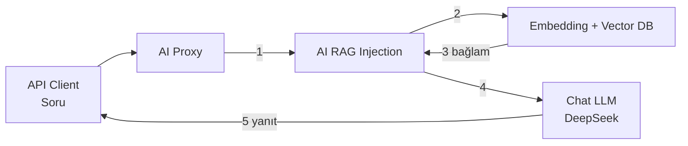

Bu senaryoda daha önce oluşturulan **Knowledge Base**, bir **AI Proxy** üzerine **AI RAG Injection** politikası eklenerek bağlanacaktır.

Böylece istemciden gelen soru önce Knowledge Base içinde aranır; bulunan doküman parçaları chat modeline **bağlam** olarak eklenir ve model bu bağlama göre cevap üretir.

Aşağıdaki grafikte yer alan numaralandırmalar işlemlerin **yapılış sırasına aittir.**



- **API Client** soruyu **AI Proxy**'ye gönderir.
- **AI RAG Injection** soruyu embedding'e çevirip **Knowledge Base / Vector DB** içinde arar.
- Bulunan parçalar isteğe **system / context** olarak eklenir.
- **Chat LLM** bağlama göre cevap üretir.
- Yanıt **API Client**'a döner.

:::info

Bu senaryo öncesi şu yapılandırmaların hazır olması gerekir:

1. Embedding Provider + Vector DB  
   → [RAG için Embedding Provider ve Vector DB Oluşturulması](./rag-embedding-provider-ve-vector-db)
2. Knowledge Base ve indexlenmiş doküman  
   → [Knowledge Base Oluşturulması ve Doküman Indexlenmesi](./knowledge-base-olusturma-ve-indexleme)
3. Chat modeli tanımlı bir **AI Proxy**  
   (ör. DeepSeek / `deepseek-chat`)

:::

:::warning

**AI Proxy Primary Routing** alanına embedding modeli (`all-minilm`) konulmamalıdır.

- **Primary Routing / LLM Provider** = chat modeli (`deepseek-chat`, `phi3:mini` vb.)
- **Embedding** = Knowledge Base ve AI RAG Injection içinde kullanılır

:::

## AI Proxy'nin Seçilmesi

**AI Gateway** menüsü altında yer alan **AI Proxies** seçeneğine tıklanır.

Chat için kullanılacak proxy seçilir. Bu senaryoda örnek olarak DeepSeek chat modeli tanımlı bir AI Proxy kullanılır.

## AI RAG Injection Politikasının Eklenmesi

Seçilen AI Proxy içinde **Develop** sekmesine tıklanır.

Request hattında **Actions** ardından **Add Policy** butonuna tıklanır.

Açılan politika listesinde **AI Policies** altında yer alan **AI RAG Injection** seçilir.

{}

## Politika Alanlarının Doldurulması

### Connection Settings

| Alan | Değer |
|------|--------|
| **Enabled** | Açık |
| **Knowledge Base** | Önceki senaryoda oluşturulan KB|
| **Vector DB Connection** | PgVector bağlantısı (KB seçilince otomatik dolar) |
| **Embedding Provider** | Ollama Embedding provider |
| **Collection Name** | `ollama_kb` |

{}

:::tip

**Knowledge Base** dropdown'ından KB seçildiğinde Vector DB, Embedding Provider ve Collection Name alanları otomatik doldurur.

:::

### Retrieval Parameters

| Alan | Önerilen Değer | Açıklama |
|------|----------------|----------|
| **Top K Results** | `4` | Döndürülecek en yakın parça sayısı |
| **Similarity Threshold** | `0.50` | Benzerlik eşiği; çok yüksek tutulursa (`0.70+`) eşleşme kaçabilir |
| **Max Context Characters** | `8000` | Modele eklenecek bağlam üst sınırı |
| **Embedding Model** | `<embedding-modeliniz>` | Knowledge Base ile aynı model |
| **Embedding Dimension** | `384` | `all-minilm` için zorunlu |

:::warning

**Embedding Model** alanında varsayılan olarak `text-embedding-3-small` gelebilir. Bu değer **mutlaka** `all-minilm:latest` olarak değiştirilmelidir.

**Embedding Dimension** alanında `1536` geliyorsa **384** yapılmalıdır. Aksi halde arama/index uyumsuzluğu oluşur.

:::

### Injection Settings

| Alan | Önerilen Değer |
|------|----------------|
| **Injection Mode** | `Prepend to System Message` |
| **On No Match** | `Pass Through (no context)` |
| **Injection Template** | Varsayılan template kullanılabilir |

Örnek template:

```text
<CONTEXT>
{{context}}
</CONTEXT>

{{prompt}}
```

İsteğe bağlı olarak modelin yalnızca bağlama dayanmasını sağlamak için template güçlendirilebilir:

```text
Aşağıdaki CONTEXT dışındaki bilgilere dayanma. Sadece CONTEXT'ten cevap ver.
<CONTEXT>
{{context}}
</CONTEXT>
```

Politika kaydedilir.

Yapılan işlemin geçerli olması için AI Proxy **Deploy** edilir.

## Test Edilmesi

AI Proxy test ekranı veya istemci üzerinden yeni bir sohbet ile soru gönderilir.

Örnek istek:

```json
{
  "model": "deepseek-chat",
  "messages": [
    {
      "role": "user",
      "content": "Apinizer nedir?"
    }
  ],
  "stream": true
}
```

:::tip

Test sırasında:

- **Yeni sohbet** açılması önerilir. Eski geçmiş, modelin Knowledge Base yerine önceki genel cevaplara bakmasına yol açabilir.
- Knowledge Base içeriğine özgü bir soru sorulmalıdır (ör. dokümanda geçen ifade).

:::

### RAG'ın Çalıştığının Doğrulanması

**AI Traffic** üzerinden ilgili istek açılır ve **Request to Target API** sekmesine bakılır.

RAG çalışıyorsa target body içinde Knowledge Base dokümanına ait metin **system** veya **context** alanında görünür.

{}

Beklenen cevap, Knowledge Base dokümanındaki bilgiye yakın olmalıdır.

Örnek:

> Apinizer, API ve AI trafiğini yönetmek, güvenlik ve politikalar uygulamak için kullanılan bir API ve AI Gateway ürünüdür.

:::info

Target request içinde bağlam görünüyor ancak cevap genel bilgiye kayıyorsa, sohbet geçmişini temizleyip tek mesajla yeniden test edin. Gerekirse Injection Template'e "sadece CONTEXT'ten cevap ver" kuralı eklenebilir.

:::

## Özet

Bu senaryoda:

- Chat **AI Proxy** seçildi
- **AI RAG Injection** politikası eklendi
- Knowledge Base / Embedding / Collection bağlandı
- Proxy deploy edilerek RAG akışı test edildi

Böylece Embedding Provider → Vector DB → Knowledge Base → AI RAG Injection zinciri tamamlanmış olur.
