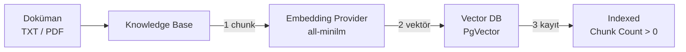

Bu senaryoda bir önceki adımda hazırlanan **Embedding Provider** ve **Vector DB** kullanılarak bir **Knowledge Base** oluşturulacak ve örnek bir doküman **indexlenecektir**.

Index işlemi tamamlandıktan sonra doküman parçaları **Vector DB** içinde vektör olarak saklanır. Sonraki senaryoda bu Knowledge Base, **AI RAG Injection** politikası ile **AI Proxy**'ye bağlanır.

Aşağıdaki grafikte yer alan numaralandırmalar işlemlerin **yapılış sırasına aittir.**



- Yüklenen doküman **chunk**'lara bölünür.
- Her chunk **Embedding Provider** ile vektöre çevrilir.
- Vektörler **Vector DB** koleksiyonuna yazılır.
- Index başarılı olursa doküman durumu **Indexed** olur ve **Chunk Count** sıfırdan büyük görünür.

:::info

Bu senaryo öncesi şu yapılandırmaların hazır olması gerekir:

- **Embedding Provider:** Ollama / `all-minilm:latest`
- **Vector DB:** PgVector bağlantısı

Bu adımlar için [RAG için Embedding Provider ve Vector DB Oluşturulması](./rag-embedding-provider-ve-vector-db.mdx) senaryosuna bakabilirsiniz.

:::

## Knowledge Base Oluşturulması

**AI Gateway** menüsü altında yer alan **Knowledge Bases** seçeneğine tıklanır.

{}

Sağ üst köşede yer almakta olan **Create** butonuna tıklanır.

Açılan ekranda **General** alanları doldurulur:

| Alan | Örnek Değer |
|------|-------------|
| **Name** | `KB-Demo` |
| **Description** | İsteğe bağlı açıklama |

**Source Configuration** alanları şu şekilde seçilir:

| Alan | Değer |
|------|--------|
| **Vector Database** | Önceki senaryoda oluşturulan PgVector bağlantısı (ör. `vectorDb`) |
| **Embedding Provider** | Önceki senaryoda oluşturulan Ollama Embedding provider |
| **Collection Name** | `ollama_kb` |

:::warning

**Collection Name** zorunludur. Bu değer Vector DB içinde oluşturulacak / kullanılacak koleksiyon (tablo) adıdır.

Aynı collection adı başka bir Knowledge Base tarafından kullanılıyorsa çakışma oluşabilir. Bu senaryoda benzersiz bir ad tercih edilmelidir.

:::

**Chunking Settings** alanları örnek olarak şu şekilde bırakılabilir:

| Alan | Değer |
|------|--------|
| **Chunk Size** | `1000` |
| **Chunk Overlap** | `200` |

{}

:::info

**Chunk Size**, dokümanın kaç karakterlik parçalara bölüneceğini belirler. **Chunk Overlap**, ardışık parçalar arasında ortak tutulan karakter sayısıdır. İlk kurulumda varsayılan / örnek değerler yeterlidir.

:::

## Doküman Yüklenmesi

**Documents** bölümünde **Upload Document** butonuna tıklanır.

Örnek içerik:

```text
Apinizer Test Dokumani

Apinizer bir API ve AI Gateway urunudur.
API guvenligi, trafik yonetimi, loglama ve politika uygulamasini kod yazmadan yapmanizi saglar.

Apinizer ne ise yarar?
Apinizer API ve AI trafikini yonetmek, guvenlik ve politikalar uygulamak icin kullanilir.
```

:::info

Dosyalar seçildikten sonra **Save** butonuna basıldığında yükleme ve index işlemi başlar.

:::

Gerekli alanlar doldurulduktan ve doküman seçildikten sonra **Save** / **Save and Deploy** butonuna tıklanır.

## Index Durumunun Kontrolü

Doküman listesinde **Status** alanı izlenir.

Beklenen sonuç:

| Alan | Beklenen |
|------|----------|
| **Status** | `Indexed` / `Ready` |
| **Chunk Count** | `0`'dan büyük |

{}

:::warning

Status **Error** veya uzun süre **Pending** kalırsa:

- Embedding Provider endpoint'inin erişilebilir olduğu kontrol edilir.
- Model ID'nin doğru olduğu teyit edilir.
- Vector DB **Test Connection** sonucu kontrol edilir.
- Embedding dimension değerinin model ile uyumlu olduğu (`all-minilm` için **384**) doğrulanır.

:::

## Vector DB'de Kayıtların Doğrulanması (Opsiyonel)

Index başarılı olduysa PostgreSQL tarafında collection / tablo oluşmuş olmalıdır.

Örnek kontrol:

```sql
SELECT COUNT(*) FROM public.ollama_kb;
SELECT id, payload FROM public.ollama_kb LIMIT 5;
```

`COUNT(*)` değeri sıfırdan büyükse vektör kayıtları yazılmış demektir.

:::tip

Tablo adı, Knowledge Base içinde verilen **Collection Name** ile aynıdır.

:::

## Sonraki Adım

Bu senaryoda:

- **Knowledge Base** oluşturuldu
- Doküman indexlendi
- Parçalar **Vector DB**'ye yazıldı

Sıradaki senaryoda bu Knowledge Base, bir **AI Proxy** üzerine **AI RAG Injection** politikası ile bağlanır.

Detay için: [AI Proxy'ye AI RAG Injection Politikası Eklenmesi](./ai-rag-injection-politikasi)
