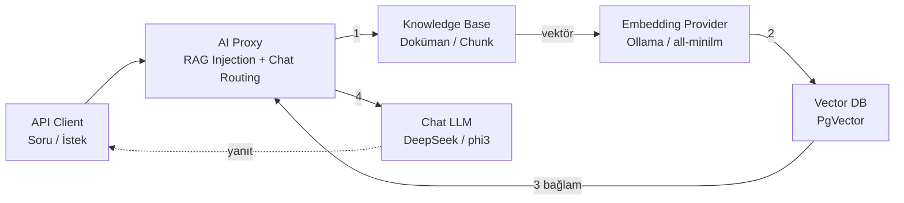

Bu senaryoda **Apinizer AI Gateway** üzerinde **RAG (Retrieval-Augmented Generation)** kullanabilmek için gerekli olan iki temel yapılandırma oluşturulacaktır:

1. Embedding üretecek bir **LLM Provider** (bu senaryoda **Ollama** / `all-minilm`)
2. Embedding vektörlerinin saklanacağı bir **Vector DB** bağlantısı (bu senaryoda **PostgreSQL + PgVector**)

Bu adımlar tamamlandıktan sonra **Knowledge Base** oluşturulabilir ve **AI Proxy** üzerine **AI RAG Injection** politikası eklenebilir.

Aşağıdaki grafikte yer alan numaralandırmalar işlemlerin **yapılış sırasına aittir.**



- Doküman metni **Embedding Provider**'a gönderilir ve **vektöre** çevrilir.
- Üretilen vektör **Vector DB**'ye yazılır / Vector DB'den benzer parçalar aranır.
- Bulunan bağlam **AI Proxy** üzerinden **chat modeline** iletilir.
- **Chat modeli**, bulunan bağlama göre **API Client**'a yanıt üretir.

:::info

**Chat modeli** ile **Embedding modeli** farklıdır.

- **Chat modeli** (`deepseek-chat`, `phi3:mini` vb.) cevap üretir.
- **Embedding modeli** (`all-minilm:latest` vb.) metni sayısal vektöre çevirir.

Bu senaryoda yalnızca **embedding** ve **vector DB** tarafı kurulur. Chat için kullanılan **AI Proxy / LLM Provider** ayrı tanımlanır.

:::

## Embedding Provider Oluşturulması

**AI Gateway** menüsü altında yer alan **LLM Providers** seçeneğine tıklanır.

{}

Sağ üst köşede yer almakta olan **Create** butonuna tıklanır ve yeni bir **provider** oluşturulmaya başlanır.

Bu senaryoda kullanılacak olan provider tipi **Ollama** olarak seçilir.

**Deployment Type** alanı **On-Premises (Self-Hosted)** olarak seçilir.

**Endpoint URL** alanına Ollama'nın OpenAI uyumlu adresi girilir. Örnek:

```text
http://<OLLAMA_HOST>:<OLLAMA_PORT>/v1
```

:::tip

Ollama varsayılan olarak `11434` portunu kullanabilir. Ortamınızda farklı bir porta alındıysa **Endpoint URL**'de bu port kullanılmalıdır.

:::

{}

### Allowed Models Tanımlanması

Provider kaydında **Allowed Models** / **Supported Models** bölümüne embedding modeli eklenir.

Bu senaryoda kullanılacak model:

| Alan | Değer |
|------|--------|
| **Model ID** | `all-minilm:latest` |
| **Display Name** | `All MiniLM` |

:::warning

**Model ID** değeri, Ollama üzerinde `ollama list` çıktısında görünen ad ile **birebir aynı** olmalıdır.

`all-minilm` yerine yanlışlıkla bir chat modeli (`phi3:mini`, `deepseek-chat` vb.) seçilirse embedding çağrıları hata alır.

:::

Gerekli alanlar doldurulduktan sonra **Save and Deploy** butonuna tıklanır.

İsteğe bağlı olarak **Test Connection** çalıştırılarak provider erişimi doğrulanabilir.

:::info

**Test Connection** çoğu durumda yalnızca endpoint erişimini (`/v1/models`) kontrol eder. Asıl embedding doğrulaması **Knowledge Base** index işlemi veya `/v1/embeddings` çağrısı ile yapılır.

:::

## Vector DB Oluşturulması

Embedding'lerin saklanması için bir **Vector DB** bağlantısı tanımlanır.

**AI Gateway** menüsü altında yer alan **Vector DBs** seçeneğine tıklanır.

{}

Sağ üst köşede yer almakta olan **Create** butonuna tıklanır.

Bu senaryoda **Database Type** olarak **PgVector** seçilir.

Connection alanları aşağıdaki gibi doldurulur:

| Alan | Açıklama | Örnek |
|------|----------|--------|
| **Name** | Apinizer'da görünen bağlantı adı | `vectorDb` |
| **JDBC URL** | PostgreSQL bağlantı adresi | `jdbc:postgresql://<HOST>:<PORT>/<DB_NAME>` |
| **Username** | Veritabanı kullanıcı adı | `apinizer` |
| **Password** | Veritabanı şifresi | `********` |
| **Default Collection Name** | Varsayılan koleksiyon/tablo adı | `apinizer_embeddings` |

{}

:::warning

Hedef PostgreSQL veritabanında **pgvector** extension'ının kurulu olması gerekir:

```sql
CREATE EXTENSION IF NOT EXISTS vector;
```

Extension yoksa **Knowledge Base** index işlemi başarısız olur.

:::

**Connect Timeout** ve **Request Timeout** değerleri ortamınıza göre bırakılabilir. İlk kurulumda varsayılanlar yeterlidir.

Kaydetmeden önce **Test Connection** çalıştırılır. Bağlantı başarılı olduktan sonra kayıt **Save and Deploy** ile tamamlanır.

## Embedding Boyutu Kontrolü

Embedding modeli ile Vector DB koleksiyon boyutu **birbirine uygun** olmalıdır.

Bu senaryoda kullanılan `all-minilm:latest` modeli için embedding boyutu **384**'tür.

| Model | Dimension |
|-------|-----------|
| `all-minilm:latest` | **384** |
| OpenAI `text-embedding-3-small` | 1536 |

:::warning

**Knowledge Base** veya **AI RAG Injection** ekranında dimension değeri yanlış bırakılırsa (örneğin `1536`) arama/index işlemi hata alabilir veya beklenen sonucu üretmeyebilir.

:::

## Sonraki Adımlar

Bu senaryoda RAG için gerekli iki altyapı bileşeni hazırlanmıştır:

- **Embedding Provider:** Ollama / `all-minilm:latest`
- **Vector DB:** PgVector bağlantısı

Sonraki senaryolarda sırasıyla:

1. [Knowledge Base Oluşturulması ve Doküman Indexlenmesi](./knowledge-base-olusturma-ve-indexleme)
2. [AI Proxy'ye AI RAG Injection Politikası Eklenmesi](./ai-rag-injection-politikasi)

adımları uygulanır.

:::tip

**Knowledge Base** oluşturulurken:

- **Vector Database** = bu senaryoda tanımlanan PgVector bağlantısı
- **Embedding Provider** = bu senaryoda tanımlanan Ollama Embedding provider
- **Collection Name** = örneğin `ollama_kb`

seçilmelidir.

:::
